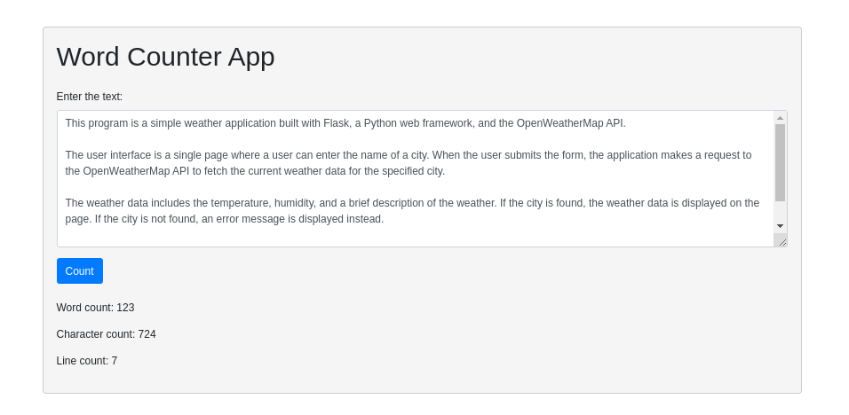

This program is a simple web application that counts the number of words, characters, and lines in a given text. The user interface is a single page with a form where users can input their text. After submitting the form, the application calculates and displays the word count, character count, and line count of the input text. The application is built using the Flask web framework and the user interface is designed with Bootstrap.

#huggingfacelink
https://huggingface.co/spaces/fahad56/wordcounter